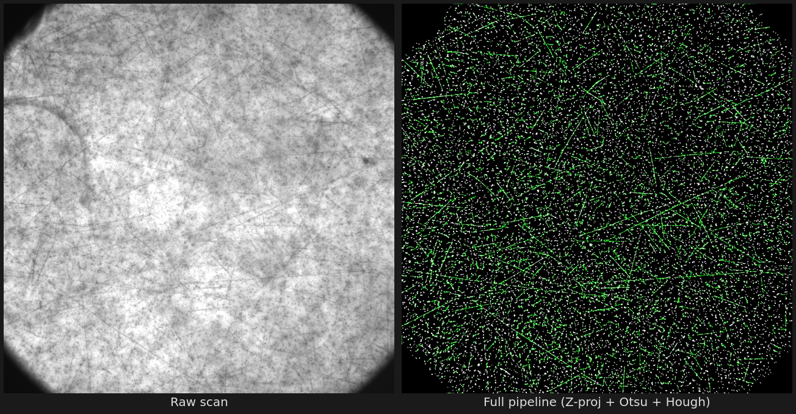
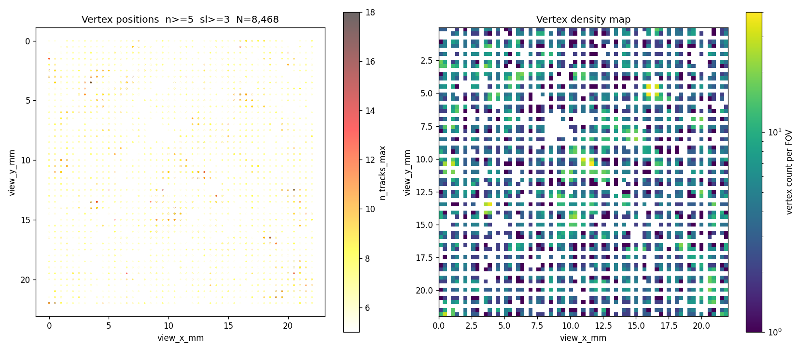
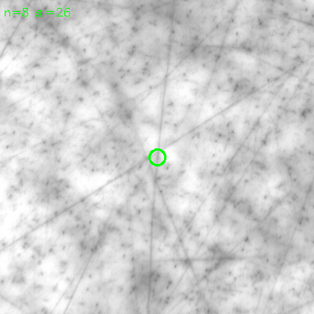
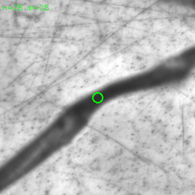

# E07 Fullscan — Analysis Notes

Running record of findings, observations, and decisions during the analysis.
Physics-focused; code usage is documented in README.md.

**Created:** 2026-05-10  **Last updated:** 2026-05-10 (angular spread filter, crop tool, teacher data)

---

## Table of Contents

1. [Pipeline Overview](#pipeline-overview)
2. [Scan Geometry](#scan-geometry)
3. [Stage 1: Image Preprocessing](#stage-1-image-preprocessing)
4. [Stage 2: Track Finding](#stage-2-track-finding)
5. [Stage 3: Track Quality Metrics](#stage-3-track-quality-metrics)
6. [Stage 4: Vertex Finding](#stage-4-vertex-finding)
7. [Stage 5: Cross-slice Merge](#stage-5-cross-slice-merge)
8. [Beam Direction](#beam-direction)
9. [Physics Goals](#physics-goals)
10. [Observed Event Types](#observed-event-types)
11. [Parameter Decisions Log](#parameter-decisions-log)
12. [Open Questions / Next Steps](#open-questions--next-steps)

---

## Pipeline Overview



```
SPNG images
    │
    ▼  [Stage 1] per slice per view
Z-projection → fog removal → Otsu threshold → noise removal
    │
    ▼  [Stage 2] HoughLinesP
Track segments  (chunk_NNNN.parquet, ~24M tracks total)
    │
    ▼  [Stage 3] quality metrics per track
length_px, mean_intens, angle_deg, n_grains, grain_density, width_px
    │
    ▼  [Stage 4] pairwise intersection + endpoint check
Per-slice vertex candidates  (vertices.parquet, ~1.75M raw)
    │
    ▼  [Stage 5] XY proximity merge across z-slices
Merged vertex candidates  (vertices_merged.parquet, ~221K)
    │
    ▼  visual inspection / further cuts
Final event candidates
```

---

## Scan Geometry

| Item | Value |
|---|---|
| Plate | MOD108 / PL12 / tohoku-v1 / AREA00 |
| Views | 2025 (45 × 45 grid) |
| FOV spacing | ~0.5 mm |
| FOV size | ~594 × 594 μm |
| **Pixel scale** | **0.29 μm/px** |
| Emulsion depth | ~150 μm |
| Slices | ~100, z-spacing ~1.5 μm/slice |

### Pixel scale note
Scanner JSON says `x = y = 0.003 mm/px` (3.0 μm/px) — **this is wrong**.
Confirmed 0.29 μm/px from scan geometry: 2048 px × 0.29 = 594 μm ≈ 0.5 mm FOV spacing.
At 0.29 μm/px individual silver grains (~0.3 μm) are barely resolvable.

### Spatial distribution of merged vertices (2026-05-10)



Left: scatter plot coloured by `n_tracks_max`. Right: log-scale density heatmap.
The 45 × 45 FOV grid structure is clearly visible. Bright clusters in the density
map mark regions with many reaction vertices — likely higher beam exposure areas.

---

## Stage 1: Image Preprocessing

Each view has ~100 Z-slices. One projected image is made per slice index.

### Z-projection (`zpj_half`)
```
img = mean( slices[idx-half : idx+half+1] )
```
- **Purpose**: integrate signal over depth; reduce single-slice noise
- **Default**: `zpj_half = 4` → 9 slices averaged → ±6 μm depth
- **Trade-off**: larger half → more signal, but blurs tracks with large dip angle
- **Optimization**: if looking for steeply dipping tracks, reduce to 2–3

### Fog removal (`fog_ksize`)
```
fog = GaussianBlur(img, ksize, 0)
clean = img - fog   (clipped to 0)
```
- **Purpose**: remove slowly-varying background illumination ("fog")
- **Default**: `fog_ksize = 51` → kernel 51 px ≈ 14.8 μm
- **Physical meaning**: removes spatial variation larger than ~15 μm
- **Trade-off**: too small → removes real signal; too large → fog not removed
- **Optimization**: should be > typical track length, < FOV size.
  At 0.29 μm/px, 51 px = 14.8 μm. For tracks up to ~500 px = 145 μm,
  consider increasing to 101–151 px.

### Otsu threshold
- **Purpose**: binarise fog-removed image into grain / background
- **Automatic**: threshold computed per image — no parameter
- **Note**: works well when grain density is moderate. Very dense or very sparse
  grain regions may cause over/under-segmentation.

### Noise removal (`noise_amin`, `noise_amax`, `noise_cmp`)
```
keep blob if: noise_amin ≤ area ≤ noise_amax AND compactness < noise_cmp
compactness = perimeter² / area
```
- **Purpose**: remove dust, dead pixels (large blobs) and single-pixel noise
- **`noise_amax = 100 px²`**: removes blobs larger than ~100 px²
  - At 0.29 μm/px: 100 px² ≈ (9 μm)² — removes large debris
  - Real grain clusters from heavy tracks can exceed this → those grains are
    removed, which is why `n_grains` underestimates for heavy particles
- **`noise_cmp = 50`**: compactness cut removes compact/round blobs
  - Round single grain: compactness = 4π ≈ 12.6 (kept, below 50)
  - Elongated track segment: compactness > 50 (removed from grain map,
    but the track itself is found by Hough, not blob detection)
  - **Key insight**: noise removal acts on the grain blob map used for
    `n_grains` counting, not on the Hough input image

---

## Stage 2: Track Finding

### HoughLinesP parameters

| Parameter | Default | Physical (0.29 μm/px) | Role |
|---|---|---|---|
| `hough_thr` | 35 | — | Accumulator threshold; higher → fewer but more reliable tracks |
| `hough_ml` | 50 px | 14.5 μm | Minimum line length; sets shortest detectable track |
| `hough_mg` | 5 px | 1.5 μm | Maximum gap allowed within a line |

#### `hough_thr` (accumulator threshold)
- Higher → stricter: only lines with many collinear pixels pass
- Too low → noise segments dominate (many short, weak lines)
- Too high → short genuine tracks missed
- **Optimized**: raised from 20 to 35 after checking track quality visually
- **How to tune**: look at track images in the web viewer; adjust until you see
  clean tracks without excessive noise segments

#### `hough_ml` (minimum line length)
- Sets the minimum physical track length that can be detected
- At 0.29 μm/px: 50 px = **14.5 μm**
- **Physics reference**:
  - 5 MeV α particle range ≈ 25 μm ≈ 86 px → detected ✓
  - Low-energy proton (few MeV) range ≈ 50–500 μm ≈ 170–1700 px → detected ✓
  - MIP (fast pion/muon) traverses entire FOV → detected ✓
- **Trade-off**: lower → catches shorter tracks but more noise segments

#### `hough_mg` (maximum gap)
- Allows small breaks in a line (due to grain fluctuations)
- At 0.29 μm/px: 5 px = 1.5 μm ≈ 5 grain spacings
- Too large → joins unrelated segments; too small → breaks real tracks

---

## Stage 3: Track Quality Metrics

Each track carries these metrics (computed in `find_tracks`):

### `length_px`
- Euclidean distance between endpoints in pixels
- Physical length = `length_px × px_scale_um` μm
- **Use**: primary track quality cut for vertex finding

### `mean_intens`
- Mean fog-removed pixel intensity sampled along the track segment
- **Independent of px_scale** → reliable even before px_scale correction
- Higher → more ionization → heavier / slower particle
- **Typical values** (from data): median ≈ 16.6, cut at ≥ 10–12
- MIP (fast pion): moderate `mean_intens`
- Slow proton / α: high `mean_intens`
- Noise segment: low `mean_intens` (near 0)

### `angle_deg`
- Track direction in the XY plane, 0–180°
- 0° / 180° = horizontal (beam direction)
- 90° = vertical
- **Distribution**: clear peak at 0–10° from beam tracks (~22% of all tracks)

### `n_grains`
- Number of grain blobs within `grain_radius` pixels of the track segment
- At 0.29 μm/px: `grain_radius = 15 px` = 4.4 μm
- **Meaningful at 0.29 μm/px** (grains are ~1 px, resolvable)
- **Caution**: current `merged.parquet` has grain_density computed with
  px_scale = 3.0 → `grain_density` is **10× too low**. Use `n_grains` directly
  or rerun track analysis with px_scale = 0.29.
- Heavy ionizing particles (α, slow nuclei) → high `n_grains`
- MIP → low `n_grains`

### `grain_density`
- `n_grains / (length_px × px_scale_um) × 100` grains per 100 μm
- **Potential particle ID metric** once px_scale is corrected:
  - MIP in emulsion: ~30–50 grains/100 μm
  - α (5 MeV): ~hundreds of grains/100 μm
  - slow proton: intermediate
- Currently unreliable (px_scale = 3.0 used in existing parquet)

### `width_px`
- Transverse spread (std dev) of nearby grain centroids
- Wider → thicker track → heavier / slower / more scattered particle
- **Potential use**: distinguish thick heavy-ion tracks from thin MIP tracks
  - Heavy nucleus track: large `width_px`
  - MIP (pion, proton): small `width_px`
- **Not yet used as a filter**; could help reject heavy-track fake vertices

### `dip_angle_deg` (from `add_dip_angles`)
- 3D dip angle computed by linking the same track across adjacent z-slices
- arctan(Δz / Δxy) over all slices the track spans
- **Current limitation**: ~98% of tracks span only 1 slice → dip = 0°
  Only ~2% have meaningful dip angles (~90° = steeply dipping)
- Not currently useful as a filter

---

## Stage 4: Vertex Finding

Algorithm per `(view_id, slice_idx)` group:

```
1. Select quality tracks: mean_intens ≥ min_intens, length_px ≥ min_len_px
2. [optional] Remove beam-parallel tracks: angle_deg < beam_angle_cut or > 180°−cut
3. All pairs (i,j): compute 2D line intersection point (vx, vy)
4. Filter pairs by:
   a. Not parallel (|denom| > 1e-6)
   b. In bounds (−512 ≤ vx,vy ≤ 2560)
   c. Perpendicular distance: imp_i < max_impact AND imp_j < max_impact
   d. Endpoint check: ep_i < min(max_ep, max_ep_frac × L_i)
                      ep_j < min(max_ep, max_ep_frac × L_j)
5. Grid-cluster intersection points (cell size = eps_px)
6. Keep clusters with ≥ min_tracks contributing tracks
```

### Parameters and their roles

#### `min_len_px` (track pre-selection)
- Tracks shorter than this do not participate in vertex finding
- **Default**: 50 px = 14.5 μm
- **Physics**: sets the shortest track type that can form a vertex
  - 50 px catches α (~86 px) and short recoil fragments
  - 100 px (old default) missed α tracks
- **Trade-off**: lower → more tracks → more combinatorics → more false vertices

#### `min_intens` (track pre-selection)
- Removes weak/noise tracks before vertex finding
- **Default**: 10.0 (lowered from 12.0 for efficiency)
- **How to optimize**: look at `mean_intens` distribution; set below the real-track peak
  but above the noise tail

#### `max_impact` (perpendicular distance)
- Maximum perpendicular distance from the intersection point to each track's line
- Filters pairs where tracks don't actually converge at a point
- **Default**: 30 px = 8.7 μm at 0.29 μm/px
- **Physics**: tracks from a common vertex should extrapolate to that point with
  precision ~ few μm → 8.7 μm is reasonable
- Increasing → more inclusive but more false vertices from non-converging tracks

#### `max_ep` and `max_ep_frac` (endpoint proximity)
- Endpoint check: the nearest endpoint of each track must be close to the vertex
- **Purpose**: reject pass-through crossings (tracks that continue beyond the vertex)
- **Two-component cut**:
  - Absolute: `ep < max_ep` (150 px = 43 μm)
  - Relative: `ep < max_ep_frac × track_length` (default 0.5)
- **Why two components**:
  - Absolute alone: a 50 px crossing track has nearest_ep ≈ 25 px < 150 px → passes (bad)
  - Relative alone: a long genuine track starting at vertex may have ep/length > 0.5
    if vertex is slightly offset
  - Combined: rejects short crossings (relative), allows long genuine tracks (absolute)
- **Genuine vertex track**: starts at vertex → nearest_ep ≈ 0–10 px → always passes
- **Crossing track**: ep ≈ length/2 → relative cut rejects when ep_frac = 0.5

#### `eps_px` (clustering radius)
- Grid cell size for clustering intersection points
- Points in the same or adjacent cells are grouped into one vertex
- **Default**: 25 px = 7.3 μm
- Too small → same physical vertex split into multiple clusters
- Too large → distinct nearby vertices merged

#### `beam_angle_cut`
- Removes tracks within `cut` degrees of horizontal (beam direction)
- **Default**: 15° (removes angle_deg < 15° and > 165°)
- Removes ~22% of tracks
- Effect on rank-1 star: loses 1 track (n=30→29), negligible signal loss
- **Why**: beam tracks at ~0° form many false intersections with other tracks

#### `min_tracks`
- Minimum number of contributing tracks to call a cluster a vertex
- **Default**: 3
- n=3 tier is noisy (mostly track crossings); n≥5 has better purity

### Known false positive types

| Type | Cause | Detection signature | Fix |
|---|---|---|---|
| Track crossing | Long tracks crossing | n=3–4, endpoint check helps | max_ep_frac |
| Heavy particle track | Thick track → parallel Hough lines → fake high-n vertex | High n_tracks, low angular spread | Angular spread filter (TODO) |
| Beam track cluster | Many beam tracks in same region | Angle near 0° | beam_angle_cut |

---

## Stage 5: Cross-slice Merge

The same physical vertex appears in multiple adjacent `slice_idx` because the
z-projection with `zpj_half=4` means each slice overlaps with ±4 neighbours.

```
For each view_id:
  Process vertices in descending n_tracks order
  Group vertices within eps_xy pixels of each other
  Output: weighted-mean position, n_tracks_max, n_slices, z range
```

### Parameters

#### `eps_xy` (XY merge radius)
- **Default**: 50 px = 14.5 μm
- Vertices of the same physical origin should appear within ~10–20 px of each other
  across slices → 50 px gives comfortable margin
- Too large → merges distinct nearby vertices

#### `n_slices` (quality metric after merge)
- How many distinct z-slices voted for this vertex
- Higher → vertex signal is persistent in depth → more likely real
- **Recommended cuts**:
  | n_slices ≥ | Fraction kept | Use case |
  |---|---|---|
  | 3 | 100% | All candidates |
  | 5 | ~78% | General selection |
  | 8 | ~39% | Higher purity |
  | 15 | ~13% | Strong candidates only |
- n_slices is correlated with vertex depth in the emulsion and track multiplicity

#### `n_tracks_max` (quality metric)
- Maximum track count seen in any single slice for this merged vertex
- Primary ranking metric
- **Observed contamination by type**:
  - n=3–4: mainly track crossings
  - n=5–10: mixed (crossings + real vertices)
  - n=8+: more likely real interaction vertices (visual inspection)
  - n≥15: heavy-particle fake vertices dominate (need angular spread filter)

---

## Beam Direction

- Beam travels **in the plane** of the emulsion (along X in the XY image plane).
- Beam tracks appear as nearly horizontal lines → peak at `angle_deg` 0–10°.
- Confirmed from track angle distribution: 22% of all tracks at 0–15° or 165–180°.
- `beam_angle_cut = 15°` removes these; rank-1 star (n=30) loses only 1 track.

---

## Physics Goals

**Current phase**: efficiency-first selection of *any* reaction vertex.
Targets: beam interactions, single-Λ hypernuclei, α decay chains, nuclear stars.
Purity is secondary at this stage.

**Ultimate goal**: double hypernuclei (ΛΛ) search.
Signature: two connected vertices separated by ~100–500 μm (30–167 px):
1. **Primary vertex** — beam + target → ΛΛ-hypernucleus + other particles (multi-prong star)
2. **Secondary vertex** — hypernucleus weak decay (kink or small star)

ΛΛ signature is distinct from:
- Single nuclear star: only primary vertex, no secondary
- α decay: 2-prong kink, no secondary star
- Heavy-track contamination: rejected by angular spread filter

---

## Observed Event Types (2026-05-10)

Systematic visual inspection of `results/vertex_sample_crops/` (8 samples per tier).

### ✓ True reaction vertex



*`n08_05_V00001395_n8_sl26.png` — clear 8-prong star (n_tracks=8, n_slices=26)*

- Multiple **thin** tracks radiating from a point at varied angles
- Seen reliably from n_tracks ≈ 8+
- Angular spread of tracks is large (tracks point in many directions)

### △ Track crossing (false positive — minor)
- Long, often beam-parallel tracks crossing at a point
- Dominant in n_tracks = 3–4 tier
- Largely suppressed by `max_ep_frac` (relative endpoint check)

### ✗ Heavy-particle track fake (false positive — major at n_tracks ≥ 15)



*`n16_07_V00000437_n28_sl28.png` — thick track with kink; Hough edges → fake n=28 vertex*

- A single thick, heavily ionizing track (slow heavy nucleus, Z ≫ 1)
- Hough detects lines along top and bottom edges of the thick track
- These near-parallel lines converge → fake high-multiplicity vertex
- Identified examples (2026-05-10):
  - `n11_01_V00000670_n15_sl25.png` — two parallel thick tracks
  - `n16_07_V00000437_n28_sl28.png` — one thick track with kink
  - `n16_08_V00001222_n24_sl29.png` — one thick curved track
- **Key feature**: contributing tracks are nearly parallel → small angular spread
- **Fix**: require angular spread of contributing track angles > threshold

---

## Parameter Decisions Log

### 2026-05-10 tuning history

| Parameter | Initial | → | Current | Reason |
|---|---|---|---|---|
| `px_scale_um` | 3.0 | → | **0.29** | Confirmed from scan geometry |
| `hough_thr` | 20 | → | 35 | Reduce noise tracks (visual check) |
| `hough_ml` | 25 px | → | 50 px | 25 px = 7.3 μm; too many noise segs |
| `hough_mg` | 4 | → | 5 | Marginal improvement |
| `grain_radius` | 10 px | → | 15 px | Better grain association at 0.29 μm/px |
| `min_len_px` | 100 px | → | 50 px | Catch α tracks (~86 px) |
| `min_intens` | 12.0 | → | 10.0 | Efficiency-first |
| `max_ep` | 100 px | → | 150 px | More inclusive endpoint window |
| `max_ep_frac` | — | → | 0.5 | New: relative endpoint cut for short tracks |
| `beam_angle_cut` | 0° | → | 15° | Remove beam-parallel tracks |
| `min_tracks_out` | 5 | → | 3 | Efficiency-first |

### Vertex count at each iteration
| Date | Run | Parameters | Raw vertices | Merged |
|---|---|---|---|---|
| 2026-05-08 | v1 | min_len=100, min_intens=12, max_ep=100, no beam cut | 95,160 | 8,468 |
| 2026-05-09 | v2 | min_len=50, min_intens=10, max_ep=150, beam_cut=15° | 6,976,451 | 642,558 |
| 2026-05-10 | v3 | + max_ep_frac=0.5 | 1,754,298 | 221,278 |

v2 explosion was caused by max_ep=150 allowing short crossing tracks through.
v3 max_ep_frac=0.5 fixed this (relative endpoint cut).

---

## Visual Inspection Findings (2026-05-10)

### Vertex crop tool (`scripts/crop_vertices.py`)
Generates 3-panel strips per vertex: RAW (min projection) | FOG-REMOVED | BINARY.
- **Min projection** across all z-slices: dark tracks accumulate, showing all tracks in the view depth
- **Contrast stretch** applied to raw panel for visibility
- **Edge tick marks + 1 px dot** mark the computed vertex position

Usage:
```bash
python scripts/crop_vertices.py \
  --vertices results/vertices_merged.parquet \
  --output-dir results/vertex_crops_teacher \
  --n-samples 30 --min-tracks 5 --max-tracks 12 --min-slices 20 \
  --shuffle --seed 7 --crop-size 200
```

### Contamination types confirmed (2026-05-10)

From 30 crops (`n_tracks 5–12`, `n_slices ≥ 20`, random seed 7):

| Category | Count | Examples |
|---|---|---|
| Emulsion artifact (crack / blob) | 7 | 003, 007, 011, 013, 025, 026, 030 |
| Good teacher (real particle tracks) | 23 | — |
| Reaction vertex candidates | 5 | 004, 017, 021, 023, 027 |

**Key finding**: high `n_slices` does NOT guarantee genuine vertices — emulsion
artifacts persist across all slices and score high `n_slices`.

### Angular spread filter (2026-05-10)
Implemented `min_angle_spread` in `find_vertices()` and `_vertices_in_group()`.
Uses doubled-angle trick for circular statistics on line directions.

- n=34 artifact vertex: `angle_spread = 14.8°` → removed by threshold ≥ 15°
- Recommendation: `--min-angle-spread 20` for next KEKCC run

### Preprocessing fix needed
Large emulsion artifacts (cracks, blobs) survive `noise_amax = 100 px²` cutoff
→ their edges are detected by Hough as near-parallel lines → fake high-n vertices.
Fix: add `noise_amax_upper` parameter to `preprocess()` to remove blobs with
`area > threshold` (e.g. 5000 px²) before Hough runs.
Requires re-running full `e07analyze` pipeline.

---

## Open Questions / Next Steps

- [x] **Angular spread filter**: implemented `min_angle_spread` in `find_vertices()`;
      n=34 artifact has spread=14.8° → threshold 15–20° removes it cleanly.
- [ ] **Preprocessing fix**: add `noise_amax_upper` to `preprocess()` to remove
      large emulsion artifact blobs before Hough; requires full re-analysis on KEKCC.
- [ ] **width_px filter**: thick tracks (heavy particles) have large `width_px`;
      could use `mean(width_px) < threshold` at vertex to reject heavy-track fakes.
- [ ] **Track re-analysis**: re-run `e07analyze` with `px_scale = 0.29` to get
      correct `grain_density` in parquet (currently 10× too low).
- [ ] **Grain density as PID**: once corrected, `grain_density` can distinguish
      α / slow proton / MIP — useful for classifying tracks at vertices.
- [ ] **Two-vertex search**: find vertex pairs in same view separated by 30–167 px
      → ΛΛ secondary decay topology.
- [ ] **Dip angle improvement**: currently only ~2% of tracks span >1 slice and
      get a meaningful dip angle. Cross-view linking may help.
